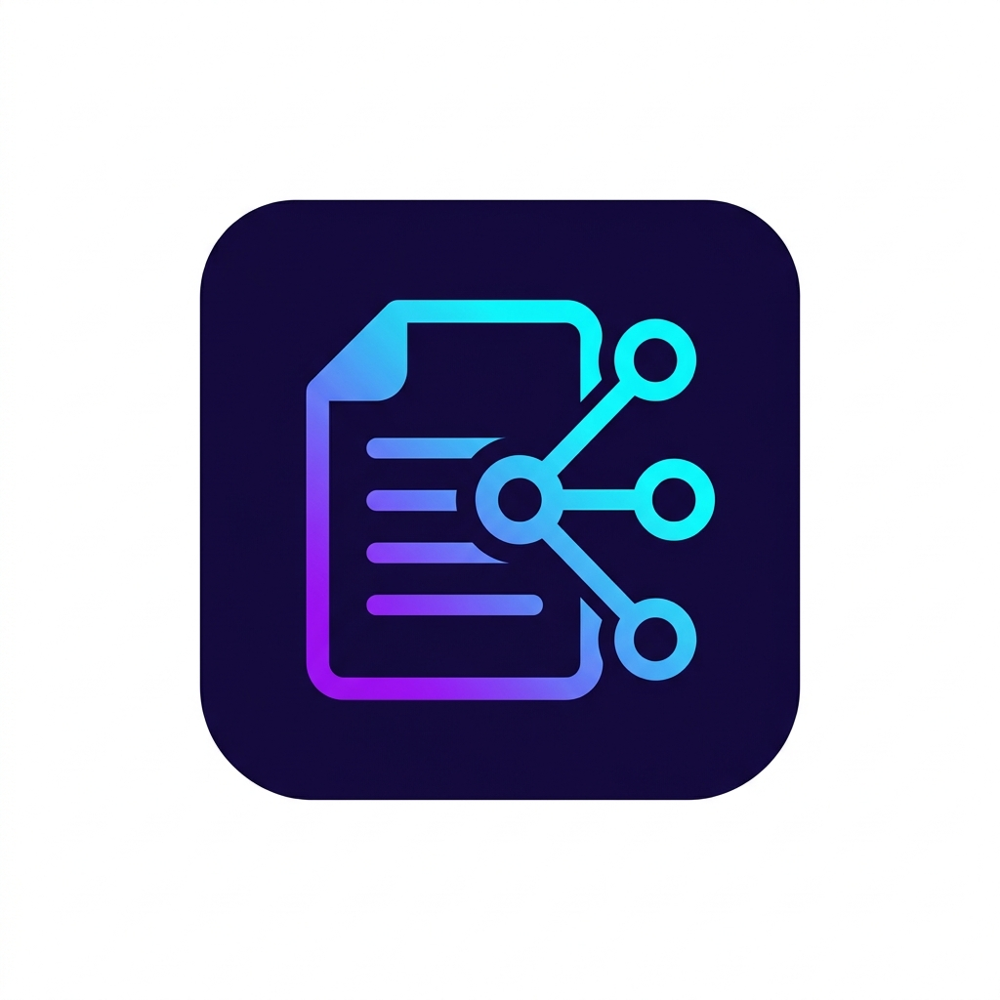
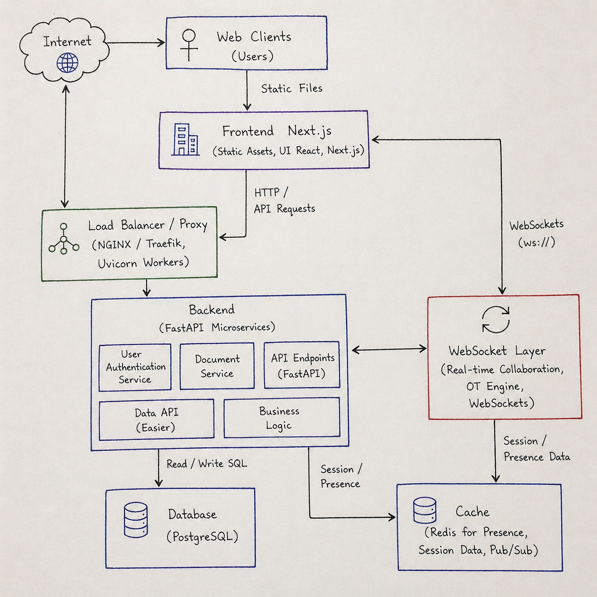
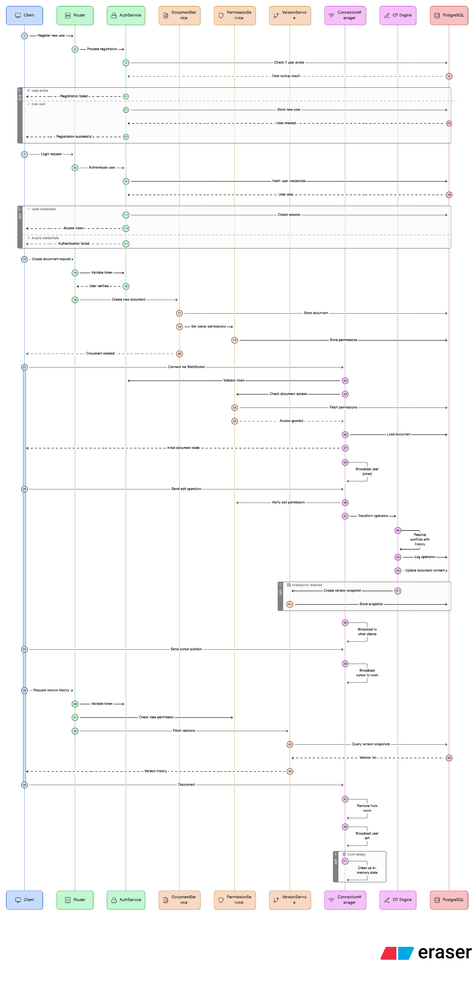
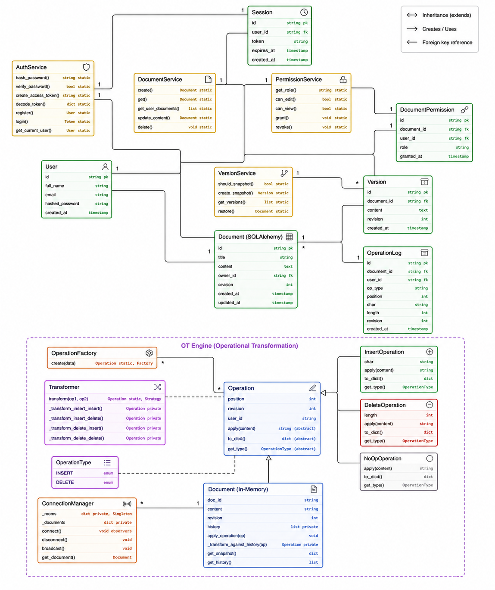
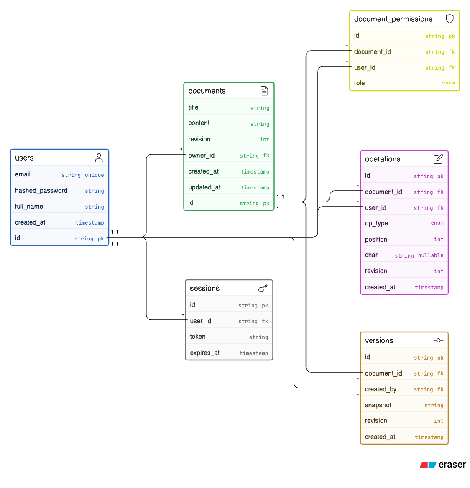

<p align="center">
  
</p>
<h1 align="center">CollabDoc — Real-Time Collaboration Platform</h1>
<p align="center">
  <em>A highly concurrent, real-time Google Docs clone built from scratch using <strong>Operational Transformation (OT)</strong> algorithms.</em>
</p>

---

## ⚡ Tech Stack

| Layer | Technology |
|---|---|
| **Frontend** | Next.js 14, TypeScript, Tailwind CSS |
| **Backend** | Python 3.11+, FastAPI, WebSockets (`uvicorn` async io) |
| **OT Engine** | Custom implementation (Insert/Delete index shifting) |
| **Database** | PostgreSQL (persistent storage via `asyncpg`) |
| **Cache / Presence** | Redis (active instances, real-time Pub/Sub broadcast) |
| **Auth** | JWT (python-jose + bcrypt) |
| **ORM** | SQLAlchemy (async) + Alembic (migrations) |
| **Containerization** | Docker + Docker Compose |

---

## 🏗️ System Architecture & Diagrams

CollabDoc is designed as a distributed **Client-Server Architecture** strictly decoupled into microservices to ensure sub-50ms latency across highly concurrent WebSocket pipelines.

### 1. High-Level Component Flow
Instead of traditional REST polling, we pipe keystrokes directly through a duplex `ws://` tunnel, relying on an in-memory `ConnectionManager` to compute algorithm states before committing to SQL.



### 2. User Capabilities & Use Cases
Our infrastructure separates permissions at the connection level. The system prevents Users from hijacking the WebSocket stream by actively verifying JWT signatures through `AuthService` Middleware before acknowledging connection bursts.


### 3. Chronological Operations Trace (Sequence)
When a user types a letter, the `OT Facade` calculates the index offsets to prevent race conditions (two people typing at the exact same location). 



### 4. Horizontal Scaling & Persistence (Redis)
To prevent the application from crashing under heavy load, WebSockets are horizontally scaled across multiple Uvicorn worker nodes. These nodes stay perfectly synchronized by publishing and subscribing to a document-specific Redis channel (`doc_channel:{UUID}`).


---

## 🧮 Software Engineering Principles

This codebase is heavily fortified with university-grade Object-Oriented design, Gang of Four (GoF) structural patterns, and SOLID constraints.

### The Domain Classes


### 1. Gang of Four (GoF) Design Patterns
| Pattern | Where it Lives | Purpose |
|---|---|---|
| **Factory Method** | `OperationFactory.create()` | Intercepts untyped JSON and dynamically classes `Insert` or `Delete`. |
| **Observer Pattern** | `ConnectionManager` | Clients subscribe to document URIs; the manager acts as the Subject to `broadcast()` DOM updates. |
| **Command Pattern** | `Operation` subclasses | Individual keystrokes are encapsulated cleanly via `.apply(char)`. |
| **Facade Pattern** | `OTService` | Provides a unified, simple interface that completely hides the complex SQL transaction logic. |
| **Singleton** | `ConnectionManager` | An application-wide global memory state mapping sockets to document IDs without leaking. |

### 2. S.O.L.I.D. Enforcement
| Principle | How We Achieved It |
|---|---|
| **Single Responsibility** | Each service has *one* strict job: `AuthService` handles hashing, `DocumentService` executes CRUD requests, preventing a massive God-Router payload block. |
| **Open/Closed** | Our `Operation` schema allows for adding a new operation format (e.g. `RichTextOperation`) by extending the abstract base without ever modifying the core `Transformer` engine. |
| **Liskov Substitution** | Any `Operation` polymorphic subclass can seamlessly replace another inside the `apply_operation()` iteration pipeline. |
| **Interface Segregation** | FastAPI inherently isolates logic into modular router boundaries (`auth.py`, `documents.py`, `websocket.py`). |
| **Dependency Inversion** | The Facade depends entirely on dependency-injecting the Database `AsyncSession`, making testing significantly easier. |

---

## 🗄️ Database Entity Architecture (ERD)

Every keystroke is permanently vaulted in persistent Postgres logs, granting the ability to scrub and reconstruct time-lapse versions of any document through `current_revision` snapshots.



---

## 🚀 Local Development Setup

To test this architecture locally, ensure you have **Docker Desktop**, **Node 18+**, and **Python 3.11+**.

### ⚡ One-Click Startup (Recommended)
For evaluators and examiners, we have provided an automated startup script that boots the entire infrastructure, runs migrations, and launches both the frontend and backend servers.

```bash
chmod +x start.sh
./start.sh
```

### Manual Startup
If you prefer to start the services individually:

**1. Boot Containerized Pipeline**
```bash
docker-compose up -d
```

**2. Ignite FastAPI Backend**
```bash
cd backend
python3 -m venv venv
source venv/bin/activate
pip install -r requirements.txt
cp .env.example .env
alembic upgrade head
uvicorn main:app --reload --port 8000
```
Interactive API docs available at [`http://localhost:8000/docs`](http://localhost:8000/docs)

**3. Surface Next.js Frontend**
```bash
cd frontend
npm install
cp .env.local.example .env.local
npm run dev
```
Navigate to [`http://localhost:3000`](http://localhost:3000) to create a room and collaborate!

---
## ✨ Development Team

| Name | Role |
|---|---|
| **Shivam Mittal** | Backend Engineering, Devops|
| **Divya Singh** | System Design, Software Engineering, Concurrency Core |
| **Kartik Yadav** | Frontend Engineering |
| **Hardik Hathwal** | Backend Engineering|

---
**License**: MIT
